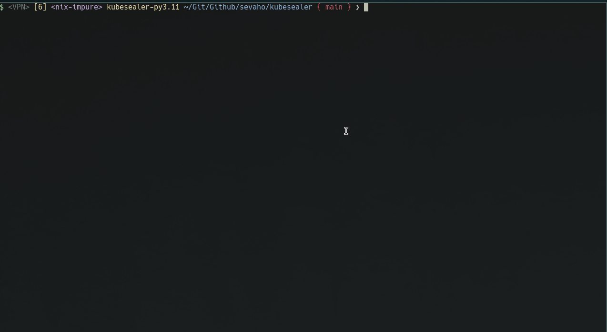
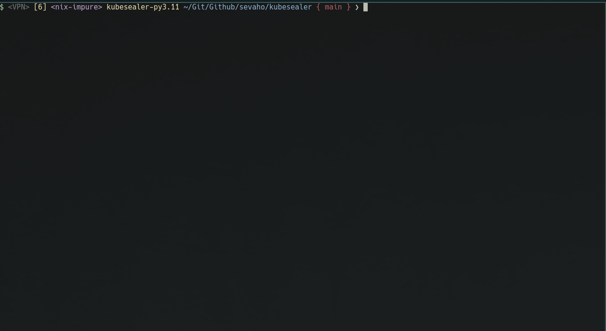

<div align="center">

# kubesealer

<b>kubesealer</b> is an interactive wrapper for [kubeseal](https://github.com/bitnami-labs/sealed-secrets) binary used to edit SealedSecrets with your favorite $EDITOR as it were native Secrets. This makes it easier to create and edit SealedSecrets.


# Credits

This repo is a small edit to the original, the heavy lifting was done by: [https://github.com/shini4i/kubeseal-auto](https://github.com/shini4i/kubeseal-auto) .


</div>

## Installation

The recommended way to install this script is [pipx](https://github.com/pypa/pipx):

```bash
pipx install kubesealer
```

## Usage

Running without commands will create a new secret

```
kubesealer
```



Editing an existing secret can be done as follows:

```
kubesealer foo.sealedsecret.yaml
```



## Contributing

Pull requests are welcome. For major changes, please open an issue first to discuss what you would like to change.
